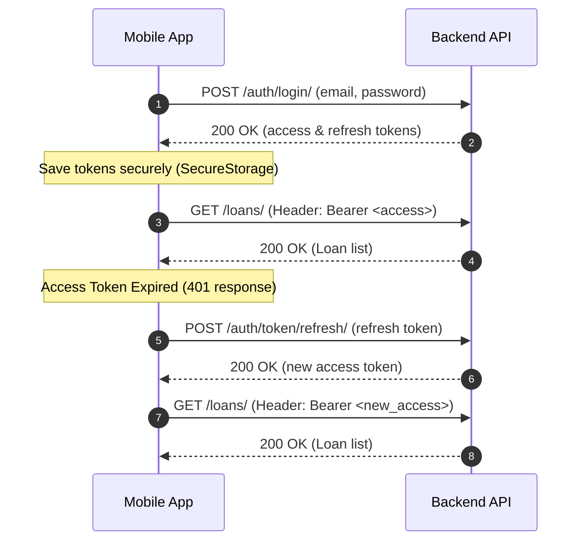
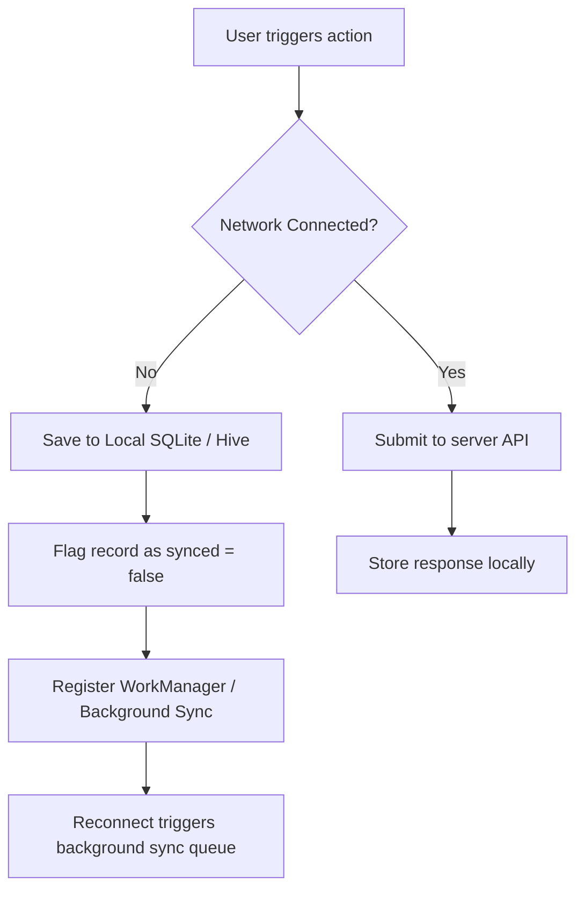

# DebtProof Mobile API Integration Specification
Version: `1.0.0`  
Audience: Flutter / React Native Mobile Developers  
Release Status: Hackathon Ready / Production Staging  

This document defines the complete backend integration contract for the DebtProof mobile application. It covers authentication flows, REST API endpoints, request/response models, blockchain integrations, offline-first sync recommendations, and network architecture configuration.

---

## 1. Network Configuration & Base URLs

Depending on your local or staging environment, configure your API client's `baseUrl` accordingly:

| Environment | Base URL | Purpose |
| :--- | :--- | :--- |
| **Development (Local Host)** | `http://127.0.0.1:8000` | Local machine backend execution (non-virtualised desktop client). |
| **Android Emulator** | `http://10.0.2.2:8000` | Loopback IP pointing to the host machine's localhost from virtualised Android. |
| **iOS Simulator** | `http://localhost:8000` | Local loopback (since iOS Simulators share the host network space). |
| **Physical Device (WiFi)** | `http://192.168.x.x:8000` | Replace `x.x` with your local machine's private IP. Requires binding django to `0.0.0.0`. |
| **Production** | `https://api.debtproof.com` | Live SSL-secured production backend API. |

---

## 2. Authentication & JWT Token Flow

DebtProof uses standard JSON Web Tokens (JWT) for secure authentication.

### Token Flow Lifecycle
1. **Login (`/auth/login/`)** yields `access` (short-lived, 1 day) and `refresh` (long-lived, 7 days) tokens.
2. Store both tokens securely inside the device's secure storage (`flutter_secure_storage` / Keychain / Keystore).
3. Append `Authorization: Bearer <access_token>` to every request header requiring authentication.
4. When a request returns `401 Unauthorized`, request a new access token via `/auth/token/refresh/` using the stored refresh token.
5. If refresh token rotation fails or returns `401`, log the user out and show the login prompt.



---

## 3. Comprehensive API Endpoints Specification

### 3.1 Authentication & User Profiles

#### Register Account
* **Endpoint:** `/api/v1/auth/register/`
* **Method:** `POST`
* **Auth Required:** No
* **Request Body:**
  ```json
  {
    "email": "user@example.com",
    "password": "SecurePassword123",
    "first_name": "John",
    "last_name": "Doe"
  }
  ```
* **Success Response (201 Created):**
  ```json
  {
    "id": "e8d98d24-3ab8-4cf5-b1a7-fb1c10faee50",
    "email": "user@example.com",
    "first_name": "John",
    "last_name": "Doe"
  }
  ```
* **Error Response (400 Bad Request):**
  ```json
  {
    "email": ["A user with that email already exists."]
  }
  ```

#### JWT Token Login
* **Endpoint:** `/api/v1/auth/login/`
* **Method:** `POST`
* **Auth Required:** No
* **Request Body:**
  ```json
  {
    "email": "user@example.com",
    "password": "SecurePassword123"
  }
  ```
* **Success Response (200 OK):**
  ```json
  {
    "refresh": "eyJhbGciOiJIUzI1NiIsIn...",
    "access": "eyJhbGciOiJIUzI1NiIsIn..."
  }
  ```

#### Refresh JWT Token
* **Endpoint:** `/api/v1/auth/token/refresh/`
* **Method:** `POST`
* **Auth Required:** No
* **Request Body:**
  ```json
  {
    "refresh": "eyJhbGciOiJIUzI1NiIsIn..."
  }
  ```
* **Success Response (200 OK):**
  ```json
  {
    "access": "eyJhbGciOiJIUzI1NiIsIn..."
  }
  ```

#### Logout / Blacklist Token
* **Endpoint:** `/api/v1/auth/logout/`
* **Method:** `POST`
* **Auth Required:** Yes
* **Request Body:**
  ```json
  {
    "refresh": "eyJhbGciOiJIUzI1NiIsIn..."
  }
  ```
* **Success Response (205 Reset Content):**
  ```json
  {
    "detail": "Logout successful."
  }
  ```

#### User Profile
* **Endpoint:** `/api/v1/auth/profile/`
* **Method:** `GET` / `PUT` / `PATCH`
* **Auth Required:** Yes
* **Headers:** `Authorization: Bearer <access_token>`
* **Success Response (200 OK):**
  ```json
  {
    "id": "e8d98d24-3ab8-4cf5-b1a7-fb1c10faee50",
    "email": "user@example.com",
    "first_name": "John",
    "last_name": "Doe"
  }
  ```

---

### 3.2 Loan Management APIs

#### List & Create Loans
* **Endpoint:** `/api/v1/loans/`
* **Method:** `GET` (List) / `POST` (Create)
* **Auth Required:** Yes
* **Headers:** `Authorization: Bearer <access_token>`
* **Query Parameters (GET):**
  * `search` (String): Search by loan name or lender name.
  * `status` (String): Filter by loan status (`active`, `closed`).
  * `ordering` (String): Sort fields (e.g. `start_date`, `-start_date`).
* **Request Body (POST):**
  ```json
  {
    "loan_name": "Home Loan",
    "lender_name": "HDFC Bank",
    "principal_amount": "500000.00",
    "interest_rate": "8.50",
    "tenure_months": 120,
    "start_date": "2026-01-15",
    "loan_type": "home",
    "status": "active"
  }
  ```
* **Success Response (200 OK for GET List):**
  ```json
  {
    "count": 1,
    "next": null,
    "previous": null,
    "results": [
      {
        "id": "4a71d8bc-7fd2-4028-a4de-129ea5b82877",
        "loan_name": "Home Loan",
        "lender_name": "HDFC Bank",
        "principal_amount": "500000.00",
        "interest_rate": "8.50",
        "tenure_months": 120,
        "start_date": "2026-01-15",
        "loan_type": "home",
        "status": "active",
        "outstanding_balance": "500000.00",
        "created_at": "2026-07-17T09:00:00Z"
      }
    ]
  }
  ```
* **Success Response (201 Created for POST):** Returns the created loan object.

#### Retrieve, Update, and Delete Loan
* **Endpoint:** `/api/v1/loans/<uuid:id>/`
* **Method:** `GET` / `PUT` / `PATCH` / `DELETE`
* **Auth Required:** Yes
* **Path Parameters:** `id` (UUID string)
* **Success Response (200 OK / 204 No Content):** Returns detail JSON or empty payload on Delete.

#### Loan Dashboard Analytics
* **Endpoint:** `/api/v1/loans/dashboard/`
* **Method:** `GET`
* **Auth Required:** Yes
* **Success Response (200 OK):**
  ```json
  {
    "total_loans": 2,
    "active_loans": 1,
    "closed_loans": 1,
    "total_outstanding": "480000.00",
    "total_paid": "20000.00",
    "recent_payments": [
      {
        "id": "18b958fb-7df2-43bb-a5cc-f39ea1cb1999",
        "amount": "10000.00",
        "payment_date": "2026-07-17",
        "payment_method": "bank_transfer",
        "status": "confirmed",
        "loan_name": "Home Loan"
      }
    ],
    "distribution": {
      "home": 1,
      "personal": 1
    }
  }
  ```

---

### 3.3 Payments & Receipts APIs

#### Record Payment (Nested Under Loan)
* **Endpoint:** `/api/v1/loans/<uuid:loan_id>/payments/`
* **Method:** `POST`
* **Auth Required:** Yes
* **Request Body:**
  ```json
  {
    "amount": "10000.00",
    "payment_date": "2026-07-17",
    "payment_method": "bank_transfer",
    "reference_number": "TXN123456789",
    "status": "confirmed",
    "notes": "July EMI repayment"
  }
  ```
* **Success Response (201 Created):**
  ```json
  {
    "id": "18b958fb-7df2-43bb-a5cc-f39ea1cb1999",
    "loan": "4a71d8bc-7fd2-4028-a4de-129ea5b82877",
    "amount": "10000.00",
    "payment_date": "2026-07-17",
    "payment_method": "bank_transfer",
    "reference_number": "TXN123456789",
    "status": "confirmed",
    "notes": "July EMI repayment"
  }
  ```

#### List All Payments
* **Endpoint:** `/api/v1/payments/`
* **Method:** `GET`
* **Auth Required:** Yes
* **Query Parameters:** `search`, `status` (`confirmed`, `pending`, `failed`), `page`, `ordering`

#### Upload Receipt File
* **Endpoint:** `/api/v1/payments/<uuid:payment_id>/receipt/`
* **Method:** `POST`
* **Auth Required:** Yes
* **Content-Type:** `multipart/form-data`
* **Request Body (Multipart Form):**
  * `file`: Binary file (PDF, JPG, PNG under 5MB).
* **Success Response (201 Created):**
  ```json
  {
    "success": true,
    "receipt": {
      "id": "78aa89b9-d2b3-4f92-aa8f-9a11a8b982ef",
      "original_filename": "receipt_july.pdf",
      "file_url": "/media/receipts/receipt_july.pdf",
      "file_size_bytes": 102400,
      "document_hash": "e3b0c44298fc1c149afbf4c8996fb92427ae41e4649b934ca495991b7852b855",
      "is_blockchain_verified": false
    }
  }
  ```

#### Generate Blockchain Proof Parameters
* **Endpoint:** `/api/v1/payments/<uuid:payment_id>/proof/generate/`
* **Method:** `POST`
* **Auth Required:** Yes
* **Success Response (200 OK):**
  * Returns the unique UUID `proof_id` and the calculated cryptographic SHA-256 `receipt_hash` needed to feed to the smart contract:
  ```json
  {
    "success": true,
    "proof_id": "90aa89c9-e3b3-5f92-bb8f-8a22a8b982fa",
    "receipt_hash": "e3b0c44298fc1c149afbf4c8996fb92427ae41e4649b934ca495991b7852b855"
  }
  ```

#### Save Blockchain Metadata
* **Endpoint:** `/api/v1/payments/<uuid:payment_id>/proof/store/`
* **Method:** `POST`
* **Auth Required:** Yes
* **Request Body:**
  ```json
  {
    "blockchain_tx_hash": "0xdcfabcd000000000000000000000000000000000000000000000000000000000",
    "blockchain_wallet_address": "0xYourWalletAddressHere",
    "blockchain_block_number": 43210,
    "blockchain_proof_id": "90aa89c9-e3b3-5f92-bb8f-8a22a8b982fa"
  }
  ```
* **Success Response (200 OK):** Returns the updated `Receipt` object with `is_blockchain_verified: true`.

#### Verify On-chain Proof Hash
* **Endpoint:** `/api/v1/payments/verify/`
* **Method:** `GET`
* **Auth Required:** No (Public endpoint to verify receipt authenticity)
* **Query Parameters:**
  * `hash`: Cryptographic SHA-256 string.
* **Success Response (200 OK - Verified):**
  ```json
  {
    "verified": true,
    "receipt": {
      "payment_amount": "10000.00",
      "loan_name": "Home Loan",
      "blockchain_tx_hash": "0xdcfabcd000000000000000000000000000000000000000000000000000000000",
      "anchored_at": "2026-07-17T09:12:00Z"
    }
  }
  ```

---

## 4. Blockchain & Smart Contract Integration

Mobile applications must communicate with the Monad Smart Contract using a web3 client library (such as `web3dart` in Flutter).

### 4.1 Network Settings
* **Network Name:** Monad Testnet
* **Chain ID:** `10143` (Hex: `0x279f`)
* **RPC URL:** `https://testnet-rpc.monad.xyz/`
* **Block Explorer:** `https://testnet.monadscan.com/`

### 4.2 Deployed Contract Address
* **Contract Address:** `0x316dF00a399d655734CeaeFfEE0A7DD432e1DB5f`

### 4.3 Required Smart Contract ABI
For mobile app developers, compile this ABI slice for web3 contract interactions:

```json
[
  {
    "inputs": [
      { "internalType": "string", "name": "_proofId", "type": "string" },
      { "internalType": "string", "name": "_receiptHash", "type": "string" }
    ],
    "name": "storeProof",
    "outputs": [],
    "stateMutability": "nonpayable",
    "type": "function"
  },
  {
    "inputs": [
      { "internalType": "string", "name": "_proofId", "type": "string" }
    ],
    "name": "verifyProof",
    "outputs": [
      { "internalType": "string", "name": "", "type": "string" },
      { "internalType": "address", "name": "", "type": "address" },
      { "internalType": "uint256", "name": "", "type": "uint256" }
    ],
    "stateMutability": "view",
    "type": "function"
  }
]
```

---

## 5. Offline Sync & Storage Strategy

For a smooth mobile user experience, implement an offline-first caching layout:



### Local Storage Schema (SQLite/Hive)
* Stored tokens: Securely save `access_token` and `refresh_token`.
* Cached datasets: `DashboardState`, `ActiveLoansList`.
* Outgoing queue: Repayments recorded offline that need uploading.

---

## 6. Error Codes Reference Guide

| HTTP Status | App Handling Logic | User-facing Notification |
| :--- | :--- | :--- |
| **200 / 201** | Standard success. Parse JSON payload. | Success |
| **400** | Serializer validation failed. Parse field dictionary. | "Please verify details entered." |
| **401** | Access token invalid. Trigger token refresh. | "Session expired. Re-authenticating..." |
| **403** | Permission denied. | "Action prohibited." |
| **404** | Resource not found. | "Requested item not found." |
| **429** | Rate limit hit. Block further hits. | "Too many requests. Please wait a minute." |
| **500** | Backend server crash. | "Service under maintenance. Try again later." |

---

## 7. Flutter Integration Checklist & Environment Variables

### Required Env Configurations
Create a `.env` in your Flutter asset directories:
```properties
API_BASE_URL_DEV=http://10.0.2.2:8000
API_BASE_URL_PROD=https://api.debtproof.com
MONAD_RPC_URL=https://testnet-rpc.monad.xyz/
MONAD_CHAIN_ID=10143
REGISTRY_CONTRACT_ADDRESS=0x316dF00a399d655734CeaeFfEE0A7DD432e1DB5f
```

### Integration Task Checklist
- [ ] Initialize `flutter_secure_storage` for token containment.
- [ ] Add `Dio` interceptor for Authorization injection and token rotation.
- [ ] Build multi-part file uploader for receipt PDF documents.
- [ ] Setup `web3dart` client targeting `MONAD_RPC_URL` and `REGISTRY_CONTRACT_ADDRESS`.
- [ ] Implement `Connectivity` listener to sync local offline SQLite payment records when the device reconnects.

---

## Appendix: Postman Collection JSON

Copy and paste this into a `postman_collection.json` file to import all request formats:

```json
{
  "info": {
    "name": "DebtProof Mobile API",
    "schema": "https://schema.getpostman.com/json/collection/v2.1.0/collection.json"
  },
  "item": [
    {
      "name": "Login",
      "request": {
        "method": "POST",
        "header": [],
        "body": {
          "mode": "raw",
          "raw": "{\n  \"email\": \"user@example.com\",\n  \"password\": \"SecurePassword123\"\n}",
          "options": { "raw": { "language": "json" } }
        },
        "url": { "raw": "{{baseUrl}}/api/v1/auth/login/" }
      }
    },
    {
      "name": "Get Loans",
      "request": {
        "method": "GET",
        "header": [
          { "key": "Authorization", "value": "Bearer {{accessToken}}" }
        ],
        "url": { "raw": "{{baseUrl}}/api/v1/loans/" }
      }
    }
  ]
}
```
