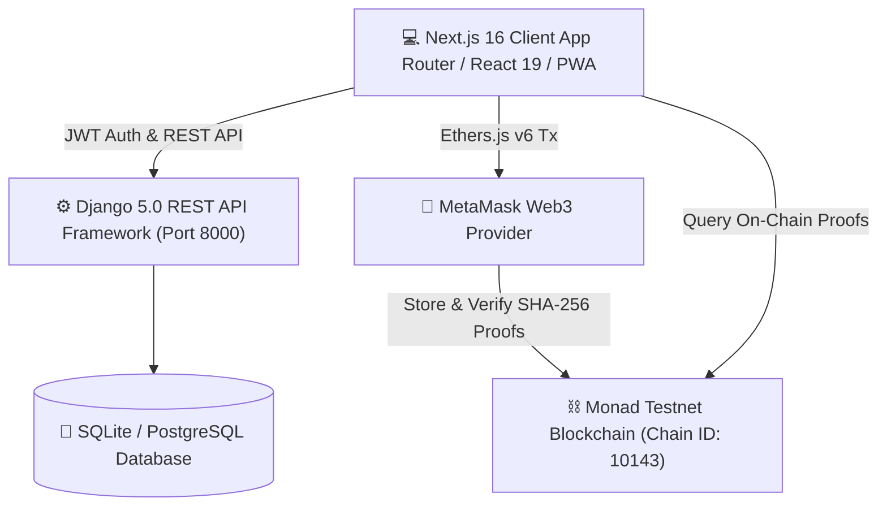
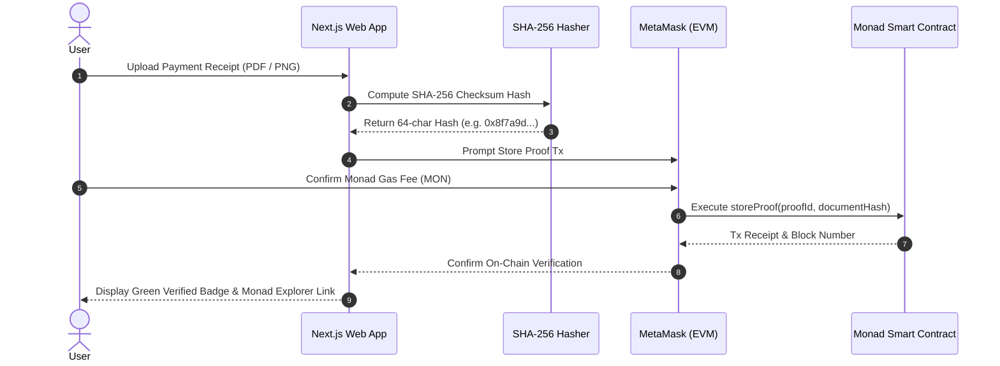
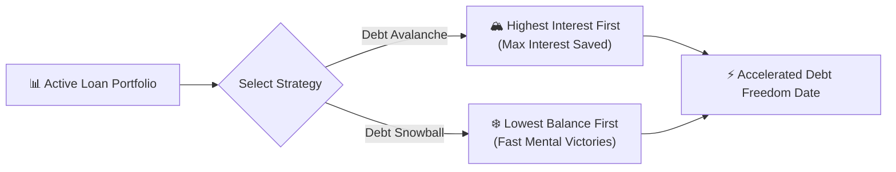

# 📑 DebtProof — Modern Decentralized Financial & Debt Management Platform 🚀

> **Never lose proof of your loan repayments again.** Manage traditional bank debts, track investments, optimize monthly household budgets, participate in P2P Web3 lending, and generate immutable cryptographic proof of every transaction on the **Monad Blockchain**.

🌐 **Live Application URL**: [https://debt-proof-front-tau.vercel.app/](https://debt-proof-front-tau.vercel.app/)

[](https://debt-proof-front-tau.vercel.app/)
[](https://github.com/sanatan-labs)
[](https://monad.xyz)
[](LICENSE)

---

## 🏗️ System Architecture & Workflow Diagram



---

## 🌟 What is DebtProof?

**DebtProof** is an end-to-end, human-first personal financial management ecosystem. Whether you are managing multiple bank loans (Home, Vehicle, Personal, Credit Cards), tracking your investment SIPs, planning monthly household budgets, or participating in peer-to-peer (P2P) lending — DebtProof brings clarity, automation, and cryptographic trust to your financial life.

Every payment receipt uploaded is hashed using **SHA-256** and anchored onto the **Monad Blockchain**, guaranteeing that your repayment records can **never be deleted, backdated, or disputed by lenders**.

---

## 🛡️ Cryptographic Proof & Monad Anchoring Workflow



---

## 🚀 Complete Feature List & User Guide

Here is a comprehensive breakdown of all **17 Core Modules** built into DebtProof, how each module works, and step-by-step instructions on how to use them:

---

### 1. 📊 Interactive Dashboard & Financial Command Center (`/dashboard`)
* **What it does**: Provides a bird's-eye view of your entire financial standing — total borrowed principal, total repaid principal, active outstanding debt, and monthly interest burn.
* **Key Capabilities**:
  * **4 KPI Cards**: Total Loans, Outstanding Balance, Upcoming EMI / Overdue Warning, and Active/Closed Status.
  * **Income & Outflow Safety Meter (`IncomeTrackerWidget`)**: Multi-source income tracker (Salary, Rental, Freelance, Business) that alerts you if your monthly EMI exceeds safe limits (Debt-to-Income > 35%).
  * **Debt Reduction Velocity & Milestones (`PayoffMilestonesWidget`)**: Visual progress bar tracking your path towards 100% debt freedom.
  * **AI Debt Coach (`AIDebtAdvisorWidget`)**: Dynamic AI coach providing custom advice based on your highest interest rate debts.
  * **Emergency Reserve Buffer (`EmergencyBufferWidget`)**: Calculates how many months of EMI payments your emergency fund covers.
  * **EMI Bounce Protection (`EMIBounceProtectionWidget`)**: Monitors linked bank accounts to prevent auto-debit bounce penalties.
  * **Multi-Currency Debt Tracker (`MultiCurrencyWidget`)**: Manage global debts across USD, EUR, GBP, and INR.
  * **Interactive Monthly Payment History Chart**: Bar and Line chart switcher with hover tooltips displaying monthly payment totals.
  * **Loan Portfolio Repayment Progress**: Visual green (paid %) vs red (remaining %) progress bars for each loan with click-to-inspect modals.
* **How to Use**:
  1. Navigate to `/dashboard`.
  2. View your financial health score and active warnings.
  3. Click on any loan progress bar to inspect loan details and schedule.
  4. Toggle between **Bar** 📊 and **Line** 📈 view on the Monthly Payment History chart.

---

### 2. 🏦 My Loans & Repayment Management (`/dashboard/loans`)
* **What it does**: Track home loans, car loans, education loans, personal loans, and business liabilities in one place.
* **Key Capabilities**:
  * **Filter & Search**: Filter loans by status (Active, Closed, Defaulted, On Hold) or category (Home, Personal, Vehicle, Education, Business, Credit Card).
  * **Add Loan (`/dashboard/loans/new`)**: Record new liabilities with principal, interest rate, EMI, start/end dates, lender name, and account number.
  * **📄 CIBIL / Bank Statement Parser (`CibilParserModal`)**: Auto-extract loan details directly from uploaded CIBIL credit reports or bank PDF statements.
* **How to Use**:
  1. Click **"+ Add Loan"** or go to `/dashboard/loans/new`.
  2. Fill in the loan details or click **"Parse CIBIL / Statement"** to auto-fill.
  3. Save the loan to start tracking monthly EMIs.

---

### 3. ⚡ Foreclosure & Lump-Sum Prepayment Calculator (`/dashboard/loans/[id]`)
* **What it does**: Calculate exact interest saved and tenure reduced by making part-payments or full foreclosure prepayments.
* **Key Capabilities**:
  * Interactive slider/input for lump-sum prepayment.
  * Real-time calculation of new interest cost vs baseline.
  * Displays exact number of months trimmed off your loan tenure.
* **How to Use**:
  1. Click on any loan to view its detail page (`/dashboard/loans/[id]`).
  2. Open the **"Part-Payment & Foreclosure Calculator"** section.
  3. Enter an extra prepayment amount (e.g. ₹50,000) to see instant tenure reduction.

---

### 4. 📜 Digital Promissory Agreement Generator (`/dashboard/loans/[id]`)
* **What it does**: Generates a formal, legally binding digital promissory note for peer-to-peer loans with family, friends, or business partners.
* **Key Capabilities**:
  * Formal legal promissory text generator.
  * Includes borrower & lender details, principal, interest, due date, and digital timestamp.
  * Generates a SHA-256 cryptographic agreement hash.
  * One-click PDF export for printing or signing.
* **How to Use**:
  1. Open a P2P loan detail page.
  2. Click **"Generate Promissory Agreement"**.
  3. Download or print the official digital contract.

---

### 5. 💵 Intelligent Budget & Cash Flow Planner (`/dashboard/budget`)
* **What it does**: A unified cash flow engine balancing monthly income streams, living expenses, EMI commitments, and savings targets.
* **Key Capabilities**:
  * **🔄 2-Way Real-time Income Sync**: Changes made in Budget Planner immediately reflect on the main Dashboard and vice versa.
  * **Budget Health Score (0–100)**: Animated health gauge rating cash flow (Excellent, Good, Fair, Tight, Critical).
  * **Visual Cash Flow Allocation Bar**: Color-coded breakdown showing percentages for EMIs, Living Expenses, Savings Target, and Free Surplus.
  * **8 Expense Categories**: Track Rent, Food, Utilities, Transport, Health, Entertainment, Education, and Miscellaneous expenses.
* **How to Use**:
  1. Go to `/dashboard/budget`.
  2. Enter monthly income sources and living expenses.
  3. Review your Budget Health Score and follow automated smart tips.

---

### 6. 📈 Wealth & Investments Tracker (`/dashboard/investments`)
* **What it does**: Track wealth-building assets including Mutual Fund SIPs, Stocks, Fixed Deposits, Real Estate, Gold, and Crypto.
* **Key Capabilities**:
  * **Investment Growth Chart**: Interactive SVG curve displaying **Invested Capital vs Current Valuation**.
  * **🚀 Future Compound Wealth Predictor**: Calculates projected wealth over 1, 3, 5, and 10 years at your expected CAGR %.
  * **Portfolio Mix Donut**: Visual percentage breakdown of asset categories.
* **How to Use**:
  1. Go to `/dashboard/investments`.
  2. Add your investment assets and expected returns.
  3. Use the **Compound Predictor** slider to estimate your wealth in 5 or 10 years.

---

### 7. 📊 Multi-Metric Analytics & Studio (`/dashboard/analytics`)
* **What it does**: Advanced financial intelligence deck featuring custom metric charting and comparative studio.
* **Key Capabilities**:
  * **Interactive Multi-Metric Chart Studio (`ModernMultiMetricChartStudio`)**: Select primary dataset (Payments, Investments, Net Worth, Debt Balance, Income), overlay two metrics, switch Area/Bar chart styles, toggle 6M/1Y/3Y horizon.
  * **Tax Savings Calculator (`TaxSavingsCalculator`)**: Calculates tax deductions under Section 80C (principal) and Section 24(b) (home loan interest).
  * **Refinancing Calculator (`RefinancingCalculatorModal`)**: Compares balance transfer options to lower interest lenders.
  * **Debt Battle Simulator (`DebtBattleSimulator`)**: Interactive scenario simulator.
* **How to Use**:
  1. Go to `/dashboard/analytics`.
  2. Use the **Chart Studio** to overlay Payments vs Net Worth.
  3. Open **Tax Savings Calculator** to see tax money saved this financial year.

---

### 8. 🚀 Payoff Accelerator Simulator (`/dashboard/repayment-simulator`)

* **What it does**: Compare payoff strategies to eliminate debt years ahead of schedule.
* **Key Capabilities**:
  * Compares **Debt Avalanche** (paying highest interest rate first) vs **Debt Snowball** (paying smallest balance first).
  * Slider for extra monthly payment (₹1,000 – ₹50,000/mo).
  * Real-time calculation of exact months saved and total interest saved.
* **How to Use**:
  1. Go to `/dashboard/repayment-simulator`.
  2. Move the extra payment slider to see how an extra ₹5,000/mo reduces your debt tenure by years.

---

### 9. 📄 Official Bank-Grade Reports & PDF Export Engine (`/dashboard/reports`)
* **What it does**: Generate bank-grade PDF statements, CSV, and JSON data exports.
* **Key Capabilities**:
  * **3 Official Reports**: Loan Portfolio Audit Statement, Payment History Log, and Net Worth Audit.
  * **Live On-Screen Voucher Preview**: Filter by loan account or date range and inspect statements live before exporting.
  * **One-Click PDF Print**: Generates clean, formatted PDF statements ready for printing.
* **How to Use**:
  1. Go to `/dashboard/reports`.
  2. Select report type and date range.
  3. Click **"Print / Download PDF"** or **"Export CSV"**.

---

### 10. 🤝 P2P Web3 Marketplace & Monad Escrow (`/dashboard/p2p-market`)
* **What it does**: Trustless peer-to-peer borrowing and lending powered by Monad Blockchain smart contracts.
* **Key Capabilities**:
  * **Zero-Middleman Escrow**: Borrowers post loan requests; lenders fund directly using **MON tokens** via MetaMask.
  * **On-chain Repayments**: Smart contracts verify and record every installment transparently.
* **How to Use**:
  1. Connect your MetaMask wallet.
  2. Go to `/dashboard/p2p-market`.
  3. Browse open loan listings or post a new borrow request.

---

### 11. 🛡️ Cryptographic Receipt Verification (`/verify-proof`)
* **What it does**: Verify payment receipt authenticity using SHA-256 cryptographic hashes on the Monad Blockchain.
* **Key Capabilities**:
  * **Tamper-Proof Verification**: Upload any receipt file to compute its hash and query the Monad Testnet.
  * **Public Admissibility**: Share your hash or transaction link with banks, courts, or auditors for independent verification.
* **How to Use**:
  1. Go to `/verify-proof`.
  2. Drag and drop any payment receipt file (PDF/PNG).
  3. View instant verification status against the Monad Testnet block explorer.

---

### 12. 📁 Receipt Vault & Voucher Storage (`/dashboard/receipts`)
* **What it does**: Centralized repository of all uploaded payment receipts and transaction vouchers.
* **Key Capabilities**:
  * Upload, view, and organize receipts for all loan payments.
  * Anchoring status indicator (Local Hash Computed vs On-Chain Anchored).
* **How to Use**:
  1. Go to `/dashboard/receipts`.
  2. Upload receipts for any recorded payment or click **"Anchor to Monad"** to store proof on-chain.

---

### 13. 💳 Credit Cards Command Center (`/dashboard/credit-cards`)
* **What it does**: Manage credit card accounts, statement balances, minimum due, and utilization ratios.
* **Key Capabilities**:
  * Track credit limit utilization meter.
  * Record card payments with instant balance updates.
* **How to Use**:
  1. Go to `/dashboard/credit-cards`.
  2. Add credit cards and record monthly card bill payments.

---

### 14. 📅 Interactive EMI Calendar (`/dashboard/calendar`)
* **What it does**: Full monthly grid calendar displaying EMI due dates and payment status.
* **Key Capabilities**:
  * Color-coded due dates: Green (Paid), Yellow (Upcoming), Red (Overdue).
  * Quick-click to record EMI directly from calendar dates.
* **How to Use**:
  1. Go to `/dashboard/calendar`.
  2. Click on any due date to record payment or view loan details.

---

### 15. 🔔 Smart Notifications & 3-Day EMI Popup (`/dashboard/notifications`)
* **What it does**: Multi-channel notification center with desktop push alerts and floating due date popups.
* **Key Capabilities**:
  * Floating 3-day EMI reminder popup (`EMIReminderPopup`).
  * Browser push notifications.
* **How to Use**:
  1. Enable notifications in browser when prompted.
  2. View alerts in `/dashboard/notifications`.

---

### 16. 💎 Net Worth & Liabilities Studio (`/dashboard/net-worth`)
* **What it does**: Consolidated net worth audit (Total Assets minus Total Liabilities).
* **How to Use**:
  1. Go to `/dashboard/net-worth` to see your current net worth calculation.

---

### 17. 📱 Progressive Web App (PWA) & Offline Sync
* **What it does**: Install DebtProof directly onto mobile or desktop home screen with offline capability.
* **Key Capabilities**:
  * Service worker (`sw.js`) caching.
  * LocalStorage offline fallback engine (`loans.service.ts` & `payments.service.ts`).
* **How to Use**:
  1. Click **"Install DebtProof"** prompt in your browser address bar.

---

## 📋 Comprehensive Module Checklist

| # | Module / Feature Name | Route Path | Primary Purpose | Status |
|---|---|---|---|---|
| 1 | **Dashboard Command Center** | `/dashboard` | Overall financial overview & safety meters | ✅ Active |
| 2 | **My Loans & Loan Manager** | `/dashboard/loans` | CRUD loans, filter, search, CIBIL parser | ✅ Active |
| 3 | **Foreclosure Prepayment Calculator** | `/dashboard/loans/[id]` | Prepayment tenure & interest savings calculator | ✅ Active |
| 4 | **Digital Promissory Agreement** | `/dashboard/loans/[id]` | Formal P2P digital contract & legal PDF | ✅ Active |
| 5 | **Budget & Cash Flow Planner** | `/dashboard/budget` | 2-way income sync & 8 expense categories | ✅ Active |
| 6 | **Investments & Wealth Tracker** | `/dashboard/investments` | Wealth growth curve & CAGR compound predictor | ✅ Active |
| 7 | **Multi-Metric Chart Studio** | `/dashboard/analytics` | Comparative charting, tax & refinance tools | ✅ Active |
| 8 | **Repayment Simulator** | `/dashboard/repayment-simulator` | Avalanche vs Snowball payoff strategy coach | ✅ Active |
| 9 | **Bank-Grade PDF Reports** | `/dashboard/reports` | Export portfolio statements to PDF/CSV/JSON | ✅ Active |
| 10 | **P2P Monad Web3 Market** | `/dashboard/p2p-market` | Trustless borrowing/lending with MON tokens | ✅ Active |
| 11 | **Cryptographic Proof Verifier** | `/verify-proof` | SHA-256 hash & Monad block explorer lookup | ✅ Active |
| 12 | **Receipt Vault** | `/dashboard/receipts` | Receipt upload & on-chain anchoring | ✅ Active |
| 13 | **Credit Cards Center** | `/dashboard/credit-cards` | Credit limits, utilization & card payments | ✅ Active |
| 14 | **Interactive EMI Calendar** | `/dashboard/calendar` | Monthly due date grid calendar | ✅ Active |
| 15 | **Notifications & 3-Day Popup** | `/dashboard/notifications` | Push alerts & floating due date reminder | ✅ Active |
| 16 | **Net Worth & Liabilities Studio**| `/dashboard/net-worth` | Total assets minus total debt breakdown | ✅ Active |
| 17 | **PWA & Offline Sync** | Global (`sw.js`) | Offline cache & installable home screen app | ✅ Active |

---

## 🛠️ Tech Stack

- **Frontend**: Next.js 16 (App Router), React 19, TypeScript, Vanilla CSS variable system, Ethers.js v6.
- **Backend**: Django 5.0, Django REST Framework, SQLite / PostgreSQL.
- **Blockchain**: Monad Testnet (Chain ID: `10143`), Solidity Smart Contracts (EVM), SHA-256 Hashing.
- **Hosting**: Deployed on Vercel ([Live Link](https://debt-proof-front-tau.vercel.app/)).

---

## 🛡️ Monad Network Configuration

- **Network Name**: Monad Testnet
- **Chain ID**: `10143` (`0x279f`)
- **RPC URL**: `https://testnet-rpc.monad.xyz/`
- **Block Explorer**: `https://testnet.monadscan.com/`
- **Smart Contract Address**: `0x316dF00a399d655734CeaeFfEE0A7DD432e1DB5f`

---

## ⚙️ How to Run Locally

### 1. Backend Setup (Django)
```bash
cd backend
python -m venv .venv

# On Windows:
.\.venv\Scripts\activate

# On Mac/Linux:
# source .venv/bin/activate

pip install -r requirements.txt
python manage.py migrate
python manage.py runserver 8000
```

### 2. Frontend Setup (Next.js)
```bash
cd frontend
npm install
npm run dev
```

Open [http://localhost:3000](http://localhost:3000) in your browser.

---

## 🌐 Live Web Application

Experience DebtProof live in production:
👉 **[https://debt-proof-front-tau.vercel.app/](https://debt-proof-front-tau.vercel.app/)**

---

*Built with ❤️ by [Sanatan Labs](https://github.com/sanatan-labs) for the Monad Blockchain Hackathon.*
