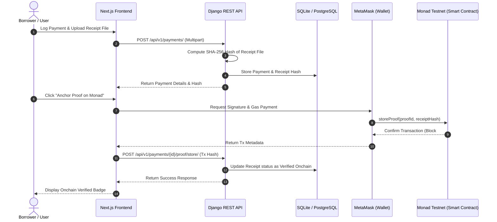

# DebtProof

> **Never lose proof of your loan repayments.**

[](https://github.com/sanatan-labs)
[](#)
[](https://monad.xyz)
[](LICENSE)

---

## Project Overview

**DebtProof** is a blockchain-powered debt management application that helps users track multiple loans while creating **immutable proof of every repayment**.

Instead of storing sensitive payment documents on-chain, DebtProof stores only the **SHA-256 cryptographic hash** of repayment receipts on the **Monad Blockchain**, allowing users to verify payment authenticity without exposing personal information.

Built for the **Monad Blockchain Hackathon** by **Sanatan Labs**.

---

## Problem Statement

Borrowers frequently face disputes with lenders over repayments they've already made:

- **Lost receipts** — physical or digital receipts get deleted, misplaced, or corrupted
- **Tampered records** — screenshots and PDFs can be forged or backdated
- **No trusted authority** — no neutral, permanent record exists that both parties can trust
- **No single view** — managing multiple loans across multiple lenders is fragmented

These problems cost borrowers time, money, and stress — especially in legal disputes.

---

## Solution

DebtProof solves this with a **three-layer approach**:

1. **Management Layer** — Track all loans, EMIs, and payment history in one clean dashboard.
2. **Proof Layer** — Hash every receipt document with SHA-256 before storage.
3. **Blockchain Layer** — Anchor the hash on Monad Blockchain for permanent, tamper-proof verification.

**Result:** Anyone with the original receipt can verify its authenticity against the blockchain hash — independently, forever.

---

## Architecture Diagram



---

## Application Workflow

DebtProof operates with a secure event-driven lifecycle:
1. **User Authentication**: Secure email login using JWT. Tokens are rotated automatically.
2. **Loan Management**: Loans are registered with principal, interest rates, and EMI details.
3. **Payment Logging**: Repayments are logged against a specific loan.
4. **Calculations via Signals**: A Django post-save signal listens for payments. If the principal and interest components are unspecified, it calculates the interest component (`running_outstanding * interest_rate / 1200`) and principal component (`amount - interest`), deducts the principal component from the loan outstanding, and auto-closes the loan if the balance hits 0.
5. **Receipt Hashing**: On receipt upload, the backend computes the SHA-256 checksum and stores it.
6. **Wallet Verification & Anchoring**: The frontend prompts the user's wallet to anchor the proof to the Monad smart contract and reports the transaction hash to the backend to lock the verification state.

---

## User Journey

```
[Register/Login] ➔ [Add active Loan] ➔ [Submit Payment & Upload Receipt] ➔ [Compute SHA-256 Hash] ➔ [Connect Wallet] ➔ [Anchor Hash on Monad] ➔ [Public Verification Portal]
```

1. **Onboarding**: A borrower signs up with their email and creates a secure account.
2. **Loan Intake**: The borrower adds their home loan details (e.g. Principal: ₹10,00,000, Interest: 8.5%).
3. **Payment Event**: When the borrower pays their EMI, they upload the bank receipt PDF/image.
4. **Cryptographic Sign-off**: The system processes the receipt and computes a SHA-256 hash (e.g., `3f786850e387...`).
5. **On-chain Anchor**: The borrower connects MetaMask, switches to Monad Testnet, and pays nominal gas to record the proof.
6. **Independent Audits**: Years later, if the lender disputes the payment, the borrower uploads the original PDF to the DebtProof Verification Portal. The portal matches the local hash against the Monad blockchain record, proving the payment's date, amount, and integrity.

---

## Blockchain & Monad Testnet Integration

### Privacy Model
DebtProof enforces a strict privacy boundary: **no financial or personally identifiable information (PII) is ever written to the blockchain.**
- **Stored Onchain:** Cryptographic Hash (SHA-256), Proof ID (UUID), Timestamp, and Wallet Address.
- **Stored Locally:** Loan amounts, interest rates, customer names, monthly EMIs, and receipt documents.

### Smart Contract Overview (`DebtProofRegistry`)
The registry contract compiles under Solidity `0.8.20` and exposes:
1. `storeProof(string proofId, bytes32 receiptHash)`: Registers a new proof. Reverts with `ProofAlreadyExists` or `ProofIdAlreadyExists` if duplicates are detected.
2. `verifyProof(bytes32 receiptHash)`: Verifies a receipt hash onchain, emitting a `ProofVerified` event.
3. `getProof(string proofId)`: View function to query proof details by its UUID string.
4. `getProofByHash(bytes32 receiptHash)`: View function to query proof details by its receipt hash.

### Monad Testnet Configuration
- **Network Name:** Monad Testnet
- **Chain ID:** `10143` (Hex: `0x279f`)
- **RPC URL:** `https://testnet-rpc.monad.xyz/`
- **Native Currency:** `MON`
- **Block Explorer:** `https://testnet.monadsv.com/`

---

## Security Model

DebtProof is built with a FinTech-grade security architecture:

1. **Zero-Knowledge Document Hashing**: Sensitive receipt PDFs/images are never read or stored on public ledgers. Only their SHA-256 hashes are anchored, ensuring complete privacy.
2. **Django Rate Limiting**: All API endpoints are protected using DRF rate throttling (`AnonRateThrottle` at 30 req/min, `UserRateThrottle` at 120 req/min, and a strict `AuthRateThrottle` at 10 req/min).
3. **JWT Session Isolation**: SimpleJWT provides short-lived access tokens (60 minutes) and secure refresh tokens with automatic blacklisting upon logout.
4. **Input Sanitization & Type Enforcement**: Robust serializer validators enforce file sizes (<5MB) and mime-types (PDF, JPG, PNG) and ensure payment amounts never exceed outstanding loan balances.

---

## Technology Stack

### Frontend
- **Next.js 16.x (App Router)** - React Framework with optimized server-side rendering
- **TypeScript 5.x** - Code safety and robust interfaces
- **Tailwind CSS v4** - Premium styling engine
- **Ethers.js v6** - Direct smart contract and MetaMask interactions

### Backend
- **Django 6.x** - High-performance Web Framework
- **Django REST Framework 3.17** - Web APIs
- **SimpleJWT 5.x** - Secure JSON Web Tokens
- **Pillow 12.x** - Image handling and validation

### Database
- **PostgreSQL** (Production standard)
- **SQLite** (Development & testing database)

---

## Folder Structure

```
DebtProof/
├── frontend/          ← Next.js App (TypeScript + Tailwind)
│   ├── src/
│   │   ├── app/               ← App Router pages
│   │   ├── components/        ← Reusable base & dashboard elements
│   │   ├── hooks/             ← useWallet, useAuth, useDebounce
│   │   ├── services/          ← API client + auth service
│   │   ├── utils/             ← cn(), formatters, contract helpers
│   │   └── styles/            ← Global CSS design system
│
└── backend/           ← Django + DRF (Python)
    ├── manage.py
    ├── config/                ← Core settings (Base, Dev, Prod)
    └── apps/
        ├── core/              ← Exceptions, Base Models, Pagination
        ├── users/             ← Custom User model + auth APIs
        ├── loans/             ← Loan model and views
        └── payments/          ← Payment, Receipt, and AuditLog models
```

---

## Installation & Setup

### Prerequisites
- Python 3.10+
- Node.js 18+
- MetaMask extension installed in browser

### Backend Setup
1. Navigate to directory:
   ```bash
   cd backend
   ```
2. Set up virtual environment:
   ```bash
   python -m venv .venv
   .venv\Scripts\activate   # Windows
   source .venv/bin/activate # macOS/Linux
   ```
3. Install packages:
   ```bash
   pip install -r requirements.txt
   ```
4. Configure environment variables:
   ```bash
   cp .env.example .env
   # Update secret key and database settings
   ```
5. Apply database migrations:
   ```bash
   python manage.py migrate
   ```
6. Run unit tests:
   ```bash
   python manage.py test
   ```
7. Start server:
   ```bash
   python manage.py runserver
   ```

### Frontend Setup
1. Navigate to directory:
   ```bash
   cd ../frontend
   ```
2. Install npm packages:
   ```bash
   npm install
   ```
3. Set up environment:
   ```bash
   cp .env.example .env.local
   ```
4. Start Next.js development server:
   ```bash
   npm run dev
   ```

---

## Smart Contract Deployment Guide

Deploy to Monad Testnet using Hardhat:

1. Navigate to blockchain directory:
   ```bash
   cd blockchain
   ```
2. Install dependencies:
   ```bash
   npm install
   ```
3. Configure your private key in `.env`:
   ```env
   PRIVATE_KEY=your_private_key_here
   ```
4. Compile the contract:
   ```bash
   npx hardhat compile
   ```
5. Run Hardhat test suite:
   ```bash
   npx hardhat test
   ```
6. Deploy to Monad Testnet:
   ```bash
   npx hardhat run scripts/deploy.js --network monadTestnet
   ```

---

## Screenshots Section

> 📸 Screens updated for Day 4 polish.

| Page | Description | Status |
|---|---|---|
| Landing Page | High-conversion hero layout with dynamic feature list | [Ready] |
| Authentication | Register/Login screens with split branding layout | [Ready] |
| Dashboard Overview | Summary cards, Quick Actions, Loan Portfolio, and Wallet Card | [Polished] |
| Loan Details | Balance tracker, repayment progress bar, and payment timeline | [Polished] |
| Proof Verification | Drag-and-drop portal showing on-chain verification results | [Polished] |

---

## Future Improvements

- **EMI Reminders**: Setup celery-beat workers to email upcoming dues 3 days in advance.
- **Advanced Analytics**: Generate downloadable repayment summaries (PDF / Excel formats).
- **Multi-Wallet Support**: Integrate WalletConnect to support Coinbase Wallet, Rabby, and other EVM wallets.
- **Gas Abstracted Anchoring**: Implement ERC-2771 meta-transactions to allow users to anchor proofs gaslessly, sponsored by the application.

---

## Contribution Guide

We welcome contributions to DebtProof! To contribute:

1. **Fork the Repository** and create a feature branch (`git checkout -b feature/amazing-feature`).
2. **Adhere to Code Quality**:
   - Python: Follow PEP 8 guidelines. Keep docstrings updated.
   - Frontend: Use strict TypeScript typing. Avoid any `any` types.
3. **Write Unit Tests**: Every API change must have corresponding tests. Run `python manage.py test` locally before proposing changes.
4. **Build Verification**: Run `npm run build` in the frontend directory to ensure TypeScript compiles correctly.
5. **Open a Pull Request** describing your changes.

---

## License

Distributed under the MIT License. See `LICENSE` for more information.

---

*Built with ❤️ by [Sanatan Labs](https://github.com/sanatan-labs) for the Monad Blockchain Hackathon.*
