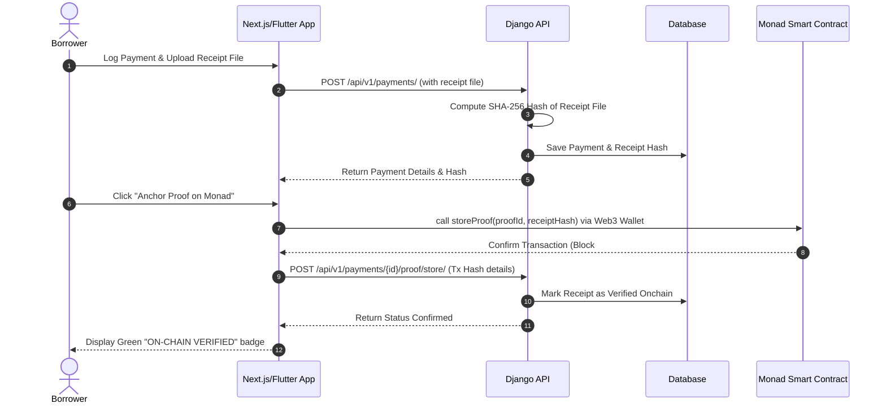

# 📑 DebtProof — Secure, Track & Verify Loan Repayments on Monad Blockchain 🚀

> **Never lose proof of your loan repayments again.** Safeguard your financial transactions with cryptographic trust.

[](https://github.com/sanatan-labs)
[](#)
[](https://monad.xyz)
[](LICENSE)

---

## 🌟 Project Overview

**DebtProof** is a modern, blockchain-powered debt management platform that allows borrowers to track their loans and create **permanent, tamper-proof proof of every repayment**. 

By anchoring cryptographic hashes of payment receipts onto the high-performance **Monad Blockchain**, DebtProof guarantees receipt authenticity without storing personal financial information on a public ledger.

---

## ⚠️ The Problem We Solve

Lenders and borrowers frequently clash over payments due to:
- **Lost Receipts 📄**: Digital receipts get deleted; physical papers get lost.
- **Tampered Records ✏️**: Backdated or photoshopped PDFs and screenshots can easily be forged.
- **No Shared Trust 🤝**: There is no permanent, neutral third-party log that both borrowers and lenders can reference years later.

### 💡 The Solution
DebtProof creates a **trustless verification system** using:
1. **Management Layer**: A beautiful React/Next.js and Flutter client dashboard to manage all liabilities.
2. **Cryptographic Proofs**: Generate SHA-256 hashes of all receipt documents locally.
3. **Immutable Anchors**: Write receipt hashes directly to the Monad Testnet blockchain.

---

## ⛓️ Monad Integration & Privacy Model

We prioritize **absolute user privacy**. No personal names, loan amounts, or payment methods are ever published on the blockchain.

### 🛡️ On-chain vs Off-chain boundary:
- **On-chain (Public)**: Unique `proof_id` (UUID), cryptographic `receiptHash` (SHA-256), anchoring wallet address, and block timestamp.
- **Off-chain (Private)**: Personal accounts, payment methods, bank reference details, and actual uploaded receipt documents.

### ⚙️ Monad Network Config:
- **Network Name:** Monad Testnet
- **Chain ID:** `10143` (Hex: `0x279f`)
- **RPC URL:** `https://testnet-rpc.monad.xyz/`
- **Block Explorer:** `https://testnet.monadscan.com/`
- **Smart Contract Address:** `0x316dF00a399d655734CeaeFfEE0A7DD432e1DB5f`

---

## 🗺️ Visual Architecture Flow



---

## 🚀 Step-by-Step Environment Setup & Installation

If you are cloning this repository from GitHub, follow this complete configuration manual.

### 📋 Prerequisites
- **Python** (version 3.10+)
- **Node.js** (version 18+)
- **Git**
- **MetaMask** wallet extension in your web browser (configured for Monad Testnet)

---

### 🐍 1. Django Backend Setup

1. **Clone and navigate to backend**:
   ```bash
   git clone https://github.com/sanatan-labs/DebtProof.git
   cd DebtProof/backend
   ```

2. **Initialize virtual environment**:
   - **Windows**:
     ```bash
     python -m venv .venv
     .venv\Scripts\activate
     ```
   - **macOS/Linux**:
     ```bash
     python -m venv .venv
     source .venv/bin/activate
     ```

3. **Install dependencies**:
   ```bash
   pip install -r requirements.txt
   ```

4. **Setup environment variables**:
   Create a `.env` file in the `backend/` folder:
   ```properties
   SECRET_KEY=dev-secret-key-debtproof-app-1234567890
   DEBUG=True
   ALLOWED_HOSTS=localhost,127.0.0.1,192.168.1.223,*
   CORS_ALLOWED_ORIGINS=http://localhost:3000,http://192.168.1.223:3000
   ```

5. **Run migrations and start backend server**:
   ```bash
   python manage.py migrate
   python manage.py runserver 0.0.0.0:8000
   ```

---

### ⚛️ 2. React/Next.js Web Setup

1. **Navigate to the frontend**:
   ```bash
   cd ../frontend
   ```

2. **Install dependencies**:
   ```bash
   npm install
   ```

3. **Setup environment variables**:
   Create a `.env.local` file in the `frontend/` folder:
   ```properties
   NEXT_PUBLIC_API_URL=http://localhost:8000/api/v1
   NEXT_PUBLIC_APP_NAME=DebtProof
   NEXT_PUBLIC_APP_VERSION=1.0.0
   ```

4. **Launch Web application**:
   ```bash
   npm run dev -- --hostname 0.0.0.0
   ```

---

### 📱 3. Flutter Mobile Setup

1. **Navigate to the Flutter directory**:
   ```bash
   cd "../DebtProof Android/DebtProof"
   ```

2. **Install packages**:
   ```bash
   flutter pub get
   ```

3. **Configure environment variables**:
   Modify `.env` file in the Flutter root directory:
   ```properties
   API_BASE_URL_DEV=http://192.168.1.223:8000
   MONAD_RPC_URL=https://testnet-rpc.monad.xyz/
   MONAD_CHAIN_ID=10143
   REGISTRY_CONTRACT_ADDRESS=0x316dF00a399d655734CeaeFfEE0A7DD432e1DB5f
   APP_ENV=development
   ```

4. **Run mobile app**:
   ```bash
   flutter run
   ```

---

## 📈 Future Vision: Building the Complete Financial Cycle

We plan to expand DebtProof from a simple tracking system into a fully autonomous, circular **Financial cycle platform**:

1. **Decentralized Escrow Clearing (P2P Lending) 🛡️**:
   - Integrate automated smart contracts that act as trustees. 
   - Borrowers and lenders deposit and receive repayments directly through on-chain escrow accounts, clearing the outstanding balance automatically without manual bank slip uploads.

2. **Zero-Knowledge Proofs (ZKP) for Credit Scoring 🕵️**:
   - Implement zero-knowledge proofs (such as zk-SNARKs) allowing borrowers to prove to third-party lenders that they have paid 100% of their EMIs on time *without* revealing their monthly incomes, loan types, or lender identities.

3. **DeFi Collateralized Refinancing 🔄**:
   - Allow users to tokenize their repayment histories as reputation NFTs. These reputation scores can serve as collateral multiplier metrics for securing cheaper, interest-adjusted loans across decentralised credit protocols on Monad.

---

*Built with ❤️ by [Sanatan Labs](https://github.com/sanatan-labs) for the Monad Blockchain Hackathon.*
