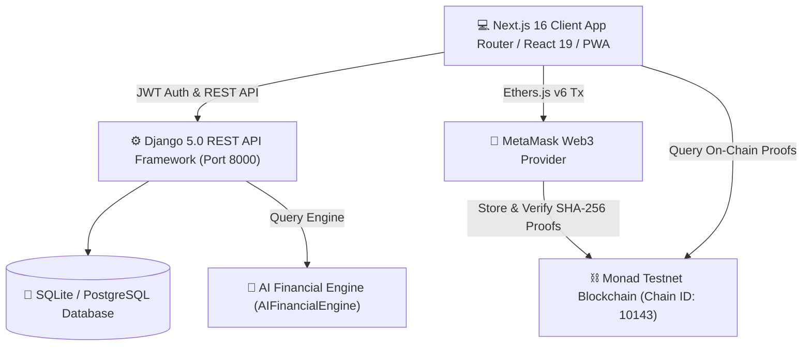

# 📑 DebtProof — Modern Decentralized Financial & Debt Management Platform 🚀

> **Never lose proof of your loan repayments again.** Manage traditional bank debts, track investments, optimize monthly household budgets, participate in P2P Web3 lending, utilize ZK-credit proofs, gamify debt payoff quests, automate auto-saves, and generate immutable cryptographic proof of every transaction on the **Monad Blockchain**.

🌐 **Live Application URL**: [https://debt-proof-front-tau.vercel.app/](https://debt-proof-front-tau.vercel.app/)

[](https://debt-proof-front-tau.vercel.app/)
[](https://github.com/sanatan-labs)
[](https://monad.xyz)
[](LICENSE)

---

## 🏗️ System Architecture & Workflow Diagram


```mermaid
graph TD
  Client["💻 Next.js 16 Client App Router / React 19 / PWA"]
  API["⚙️ Django 5.0 REST API Framework (Port 8000)"]
  AIEngine["🤖 AI Financial Engine (AIFinancialEngine)"]
  DB[("💾 SQLite / PostgreSQL Database")]
  Blockchain["⛓️ Monad Testnet Blockchain (Chain ID: 10143)"]
  Wallet["🦊 MetaMask Web3 Provider"]

  Client -->|JWT Auth & REST API| API
  API --> DB
  API -->|Query Engine| AIEngine
  Client -->|Ethers.js v6 Tx| Wallet
  Wallet -->|Store & Verify SHA-256 Proofs| Blockchain
  Client -->|Query On-Chain Proofs| Blockchain
```

---

## 🌟 What is DebtProof?

**DebtProof** is an end-to-end, human-first personal financial management ecosystem. Whether you are managing multiple bank loans (Home, Vehicle, Personal, Credit Cards), tracking your investment SIPs, planning monthly household budgets, participating in peer-to-peer (P2P) lending, creating Zero-Knowledge (ZK) credit proofs, or playing debt-destroyer payoff games — DebtProof brings clarity, automation, and cryptographic trust to your financial life.

Every payment receipt uploaded is hashed using **SHA-256** and anchored onto the **Monad Blockchain**, guaranteeing that your repayment records can **never be deleted, backdated, or disputed by lenders**.

---

## 🚀 Complete 27 Features & Options Breakdown (With Step-by-Step Usage & FAQs)

Below is the complete guide for all **27 features/options** available in DebtProof, along with step-by-step usage instructions and Frequently Asked Questions (FAQs). *All FAQs are fully supported and answered by our built-in AI Assistant (`/dashboard/assistant`).*

---

### 1. 📊 Interactive Dashboard & Financial Command Center (`/dashboard`)
* **What it does**: Central command center providing a bird's-eye view of your entire financial standing — total borrowed principal, total repaid principal, active outstanding debt, and monthly interest burn.
* **How to Use**:
  1. Navigate to `/dashboard`.
  2. View top KPI cards (Total Borrowed, Total Repaid, Outstanding, Monthly EMI).
  3. Monitor Income & Outflow Safety Meter to check if total EMI stays below 35% of income.
  4. Toggle between Bar 📊 and Line 📈 views on the Monthly Payment History chart.
* **❓ FAQs**:
  * **Q: What is a safe Debt-to-Income (DTI) ratio?**
    * **AI Answer**: A healthy DTI ratio is below **35%**. If your monthly EMI burden exceeds 40–50%, our AI alerts you to pause new debt and focus on high-interest repayment.
  * **Q: How is my total outstanding debt calculated?**
    * **AI Answer**: Total outstanding is calculated by subtracting all recorded principal repayments from your original loan amounts across active loans.

---

### 2. 🏦 My Loans & Repayment Manager (`/dashboard/loans`)
* **What it does**: Track home loans, car loans, education loans, personal loans, and business liabilities in one place.
* **How to Use**:
  1. Click **"+ Add Loan"** or go to `/dashboard/loans/new`.
  2. Enter lender name, loan category, interest rate (p.a.), EMI, and tenure.
  3. Click **"📄 Parse CIBIL / Statement"** modal to auto-extract loan data from PDF reports.
* **❓ FAQs**:
  * **Q: How does the CIBIL / Bank Statement Parser work?**
    * **AI Answer**: It scans uploaded CIBIL or bank PDF statements, extracts loan account numbers, principal amounts, interest rates, and auto-populates your loan form.
  * **Q: Can I edit or close a loan once paid off?**
    * **AI Answer**: Yes! Click any loan card, click **"Edit Loan"** or update status to **"Closed"** when remaining balance reaches zero.

---

### 3. 💳 Credit Cards Command Center (`/dashboard/credit-cards`)
* **What it does**: Track credit card balances, credit limits, minimum due amounts, and billing dates.
* **How to Use**:
  1. Go to `/dashboard/credit-cards`.
  2. Add your credit cards with total credit limit and current balance.
  3. Monitor credit card utilization gauge (keep below 30% for optimal credit score).
* **❓ FAQs**:
  * **Q: Why is keeping credit utilization below 30% recommended?**
    * **AI Answer**: Credit bureau algorithms penalize high credit utilization (>30%), lowering your credit score even if you pay on time.

---

### 4. 💵 Intelligent Budget & Cash Flow Planner (`/dashboard/budget`)
* **What it does**: Unified budgeting engine synchronizing income sources, living expenses, and EMI commitments.
* **How to Use**:
  1. Go to `/dashboard/budget`.
  2. Add income sources in the Income tab (synchronizes live with main Dashboard).
  3. Set 8 category living expenses (Rent, Food, Utilities, Transport, etc.).
  4. Save plan and inspect your Budget Health Score (0-100).
* **❓ FAQs**:
  * **Q: Does budget income sync automatically with the main Dashboard?**
    * **AI Answer**: Yes! Budget income streams feature 2-way real-time synchronization with the Dashboard Income Safety Meter.

---

### 5. 📈 Investments & Wealth Tracker (`/dashboard/investments`)
* **What it does**: Track wealth-building assets (Mutual Funds, Stocks, FDs, Real Estate, Gold, Crypto).
* **How to Use**:
  1. Go to `/dashboard/investments`.
  2. Add investment items with current value and expected CAGR %.
  3. Use the **Future Compound Wealth Predictor** to project growth over 1, 3, 5, and 10 years.
* **❓ FAQs**:
  * **Q: How does the Future Compound Wealth Predictor work?**
    * **AI Answer**: It uses the standard compound interest formula \(A = P(1 + r/n)^{nt}\) with your asset growth rate to estimate future net worth.

---

### 6. 📊 Multi-Metric Analytics & Studio (`/dashboard/analytics`)
* **What it does**: Advanced financial intelligence suite with metric overlays, tax calculators, and refinancing comparison.
* **How to Use**:
  1. Go to `/dashboard/analytics`.
  2. Overlay two metrics (e.g. Payments vs Net Worth) on the interactive chart.
  3. Open **Tax Savings Calculator** to estimate tax deductions under Section 80C and Section 24(b).
* **❓ FAQs**:
  * **Q: How much tax can I save on my home loan under Indian Tax Laws?**
    * **AI Answer**: You can claim up to ₹1.5 Lakh under Section 80C for principal repayment and up to ₹2 Lakh under Section 24(b) for home loan interest.

---

### 7. 💸 Payments Log & History (`/dashboard/payments`)
* **What it does**: Comprehensive record of every EMI paid, with principal vs interest breakdown.
* **How to Use**:
  1. Go to `/dashboard/payments`.
  2. Click **"Record Payment"** to log an EMI, specifying payment mode and receipt attachment.
* **❓ FAQs**:
  * **Q: Why is splitting payment into principal and interest important?**
    * **AI Answer**: It lets you see how much money is reducing your actual debt vs money paid to the lender as interest.

---

### 8. 📁 Receipt Vault & Monad Anchoring (`/dashboard/receipts`)
* **What it does**: Store payment receipt files and anchor SHA-256 document hashes to Monad Testnet.
* **How to Use**:
  1. Go to `/dashboard/receipts`.
  2. Upload receipt PDF/PNG.
  3. Click **"Anchor to Monad Blockchain"** to generate immutable proof.
* **❓ FAQs**:
  * **Q: Can a bank or lender challenge an anchored receipt?**
    * **AI Answer**: No! Monad Blockchain records are immutable. The SHA-256 hash proves the exact file existed without modification at the block timestamp.

---

### 9. 📅 Interactive EMI Due Calendar (`/dashboard/calendar`)
* **What it does**: Monthly calendar grid highlighting EMI due dates and payment status.
* **How to Use**:
  1. Go to `/dashboard/calendar`.
  2. Inspect green (Paid), yellow (Upcoming), and red (Overdue) dates.
  3. Click any date to record payment immediately.
* **❓ FAQs**:
  * **Q: Can I sync this calendar with Google Calendar?**
    * **AI Answer**: Yes, click **"Export iCal"** to import your EMI schedule into Google Calendar or Apple Calendar.

---

### 10. 🚀 Repayment Simulator & Payoff Strategies (`/dashboard/repayment-simulator`)
* **What it does**: Compare Debt Avalanche vs Debt Snowball strategies with extra payment sliders.
* **How to Use**:
  1. Go to `/dashboard/repayment-simulator`.
  2. Move extra payment slider (e.g. ₹5,000 extra/mo).
  3. Compare total interest saved and payoff date between Avalanche and Snowball.
* **❓ FAQs**:
  * **Q: What is the difference between Avalanche and Snowball?**
    * **AI Answer**: **Avalanche** pays highest interest rate debt first (saves maximum money). **Snowball** pays smallest balance debt first (provides quick psychological wins).

---

### 11. 📄 Official PDF Reports & Statement Engine (`/dashboard/reports`)
* **What it does**: Generate official bank-grade PDF statements, CSV, and JSON data exports.
* **How to Use**:
  1. Go to `/dashboard/reports`.
  2. Select report type (Portfolio Statement, Payment History, Net Worth).
  3. Click **"Print / Download PDF"** or **"Export CSV"**.
* **❓ FAQs**:
  * **Q: Are generated PDF statements accepted for loan applications?**
    * **AI Answer**: Yes, DebtProof PDF reports include cryptographic transaction hashes and formal account summaries standard for audit use.

---

### 12. 🤝 P2P Web3 Marketplace & Escrow (`/dashboard/p2p-market`)
* **What it does**: Peer-to-peer borrowing and lending using Monad Testnet MON tokens and smart contract escrow.
* **How to Use**:
  1. Connect MetaMask wallet.
  2. Go to `/dashboard/p2p-market`.
  3. Create loan request or fund open listings with MON tokens.
* **❓ FAQs**:
  * **Q: How does Monad Smart Contract Escrow protect lenders?**
    * **AI Answer**: Funds are locked in smart contract escrow and disbursed automatically. Repayments are enforced on-chain with zero middleman fees.

---

### 13. 🛡️ Cryptographic Proof Verifier (`/verify-proof`)
* **What it does**: Verify payment receipt document hash against Monad Testnet blockchain.
* **How to Use**:
  1. Go to `/verify-proof`.
  2. Drop receipt file or enter 64-character SHA-256 hash.
  3. View green verification badge, block number, and Monad scan link.
* **❓ FAQs**:
  * **Q: Do I need a Web3 wallet to verify a proof?**
    * **AI Answer**: No! Verification queries public Monad RPC directly and requires no wallet connection or gas fees.

---

### 14. 🤖 AI Financial Coach & Strategy Assistant (`/dashboard/assistant`)
* **What it does**: Conversational AI assistant analyzing actual DB records to answer financial queries.
* **How to Use**:
  1. Go to `/dashboard/assistant`.
  2. Choose a quick prompt or type natural questions like *"Which loan should I close first?"*.
  3. View real-data answer and strategy insights.
* **❓ FAQs**:
  * **Q: Does the AI assistant use mock data or real numbers?**
    * **AI Answer**: It uses `AIFinancialEngine` to compute exact numbers from your live database loans and payment logs.

---

### 15. 🔔 Notifications & 3-Day EMI Reminders (`/dashboard/notifications`)
* **What it does**: Alert center with desktop push alerts and floating EMI reminders.
* **How to Use**:
  1. Allow browser notifications when prompted.
  2. Review notifications list or swipe mobile cards to mark read.
* **❓ FAQs**:
  * **Q: When does the floating EMI reminder trigger?**
    * **AI Answer**: It pops up 3 days before any loan EMI due date so you never miss a payment or suffer bounce fees.

---

### 16. 💎 Net Worth & Liabilities Studio (`/dashboard/net-worth`)
* **What it does**: Consolidated view of Total Assets minus Total Outstanding Debt.
* **How to Use**:
  1. Go to `/dashboard/net-worth`.
  2. View live Net Worth gauge, asset allocation, and debt ratio.
* **❓ FAQs**:
  * **Q: How can I increase my Net Worth faster?**
    * **AI Answer**: Increase monthly investment SIPs while prepaying debts with interest rates > 10% p.a.

---

### 17. 🛡️ ZK-Credit Proof Studio (`/dashboard/zk-proofs`)
* **What it does**: Generate Zero-Knowledge (ZK) credit score and repayment reliability proofs without exposing private income or bank statement details.
* **How to Use**:
  1. Go to `/dashboard/zk-proofs`.
  2. Select threshold (e.g. Credit Score > 750 or 0 Defaults in 12 Months).
  3. Click **"Generate ZK Proof"** to copy cryptographic proof string.
* **❓ FAQs**:
  * **Q: What is a ZK-Credit Proof?**
    * **AI Answer**: Zero-Knowledge proofs mathematically prove to a lender that you meet financial criteria without sharing your actual bank balance or private identity.

---

### 18. 🎯 Debt Destroyer Payoff Quest Game (`/dashboard/payoff-quest`)
* **What it does**: Gamified debt reduction engine with XP points, streak counters, badges, and level unlocks.
* **How to Use**:
  1. Go to `/dashboard/payoff-quest`.
  2. Complete quests like *"Pay EMI 3 days early"* or *"Make ₹2,000 part-payment"*.
  3. Earn XP to level up from Debt Novice to Debt Free Master.
* **❓ FAQs**:
  * **Q: Do XP points expire?**
    * **AI Answer**: No! XP points build lifetime debt destruction streaks and unlock custom dashboard themes.

---

### 19. 🏦 Refinance Savings Studio (`/dashboard/refinance`)
* **What it does**: Balance transfer and refinancing calculator comparing your current loan rate with lower market offers.
* **How to Use**:
  1. Go to `/dashboard/refinance`.
  2. Select active loan and enter new lower interest rate offered by rival banks.
  3. View net interest savings after processing fee deduction.
* **❓ FAQs**:
  * **Q: When is refinancing worth the processing fees?**
    * **AI Answer**: Refinancing is beneficial if interest rate drops by at least 0.50% to 1.00% and remaining loan tenure is > 3 years.

---

### 20. ⚡ Auto-Saver Micro-Deposit Engine (`/dashboard/auto-saver`)
* **What it does**: Round up daily transactions or set daily micro-deposits to auto-prepay high-interest debt.
* **How to Use**:
  1. Go to `/dashboard/auto-saver`.
  2. Enable spare change round-ups (e.g. ₹42 coffee rounds to ₹50; ₹8 saved).
  3. Accumulated savings automatically apply as part-payments at month end.
* **❓ FAQs**:
  * **Q: How much can spare change round-ups save?**
    * **AI Answer**: Users save an average of ₹1,200 – ₹3,000 per month, cutting up to 1.5 years off long-term loan tenure.

---

### 21. 🏢 Multi-Tenant Organization & Teams (`/dashboard/organization`)
* **What it does**: Multi-user tenancy management for households, joint families, small businesses, or team roles.
* **How to Use**:
  1. Go to `/dashboard/organization`.
  2. Create or join organization workspace.
  3. Assign roles (Owner, Admin, Member, Auditor).
* **❓ FAQs**:
  * **Q: Can household members view shared family loans?**
    * **AI Answer**: Yes! Organization members share workspace loans while maintaining role-based access security.

---

### 22. 👥 Joint Workspace (`/dashboard/joint-workspace`)
* **What it does**: Shared financial space for co-borrowers (spouses, business partners) to co-manage home loans or business credit.
* **How to Use**:
  1. Go to `/dashboard/joint-workspace`.
  2. Invite co-borrower via email.
  3. Approve co-signed payments and view split contribution stats.
* **❓ FAQs**:
  * **Q: How do co-signed payments work?**
    * **AI Answer**: Both parties receive payment notifications and payment logs record which co-borrower paid each EMI share.

---

### 23. 📊 Automated Activity Timeline & Audit (`/dashboard/activity`)
* **What it does**: Unified chronological log of all user activities, security logins, loan updates, and AI interactions.
* **How to Use**:
  1. Go to `/dashboard/activity`.
  2. Filter activity entries by event type (Loans, Payments, Security, AI Queries).
* **❓ FAQs**:
  * **Q: Is activity logging secure?**
    * **AI Answer**: Yes, activity logs are stored in system audit tables with IP address and timestamp records for compliance.

---

### 24. 📄 Statement Import Studio (`/dashboard/statement-import`)
* **What it does**: Batch upload CSV/Excel/PDF bank statements for automated transaction matching.
* **How to Use**:
  1. Go to `/dashboard/statement-import`.
  2. Drag and drop bank statement file.
  3. Map column fields and click **"Import & Reconcile"**.
* **❓ FAQs**:
  * **Q: What bank formats are supported?**
    * **AI Answer**: Supports standard CSV, Excel (.xlsx), and PDF statements from major banks (HDFC, SBI, ICICI, Axis, Chase, BoA).

---

### 25. 📜 Debt Freedom Certificate Modal (`/dashboard/loans`)
* **What it does**: Generates a celebratory digital Debt Freedom Certificate when a loan balance reaches ₹0.
* **How to Use**:
  1. Complete 100% repayments on any loan.
  2. Click **"Claim Debt Freedom Certificate"** modal.
  3. Download framed PDF certificate or share verified badge.
* **❓ FAQs**:
  * **Q: Can I verify my Debt Freedom Certificate on-chain?**
    * **AI Answer**: Yes! Debt Freedom Certificates include Monad Blockchain cryptographic hashes for permanent proof of payoff.

---

### 26. ❓ Help Center & Complete Feature Guide (`/dashboard/help`)
* **What it does**: Comprehensive interactive documentation portal detailing all modules, step-by-step usage, and key benefits.
* **How to Use**:
  1. Go to `/dashboard/help`.
  2. Filter guides by Core, Analytics, Web3, or Tools categories.
  3. Search any feature term to view instant usage instructions.
* **❓ FAQs**:
  * **Q: Where can I get instant answers if I have a question about any feature?**
    * **AI Answer**: Use the Help Center search or open the AI Strategy Assistant (`/dashboard/assistant`), which answers all feature FAQs instantly.

---

### 27. ⚙️ SaaS Admin & Settings Command Center (`/dashboard/settings` & `/dashboard/admin`)
* **What it does**: User profile preferences, currency selection (INR ₹, USD $, EUR €, GBP £), security sessions, and administrative flag controls.
* **How to Use**:
  1. Go to `/dashboard/settings`.
  2. Switch preferred base currency or toggle dark/light theme.
  3. Manage active sessions or system admin flags.
* **❓ FAQs**:
  * **Q: Does changing base currency convert all loan amounts?**
    * **AI Answer**: Yes! Changing currency in Settings updates formatting across Dashboard, Loans, Budget, and Analytics live.

---

## 📋 Complete 27-Module Quick Reference Table

| # | Feature / Option Name | Route Path | Primary Purpose | AI Assistant FAQ Support |
|---|---|---|---|---|
| 1 | **Dashboard Command Center** | `/dashboard` | Overall financial overview & safety meters | ✅ Full Support |
| 2 | **My Loans & Repayment Manager** | `/dashboard/loans` | CRUD loans, filter, search, CIBIL parser | ✅ Full Support |
| 3 | **Credit Cards Command Center** | `/dashboard/credit-cards` | Credit limits, utilization & card payments | ✅ Full Support |
| 4 | **Budget & Cash Flow Planner** | `/dashboard/budget` | 2-way income sync & 8 expense categories | ✅ Full Support |
| 5 | **Investments & Wealth Tracker** | `/dashboard/investments` | Wealth growth curve & CAGR compound predictor | ✅ Full Support |
| 6 | **Multi-Metric Analytics Studio** | `/dashboard/analytics` | Comparative charting, tax & refinance tools | ✅ Full Support |
| 7 | **Payments Log & History** | `/dashboard/payments` | Record EMIs, principal vs interest split | ✅ Full Support |
| 8 | **Receipt Vault & Monad Anchoring**| `/dashboard/receipts` | Receipt upload & on-chain SHA-256 anchoring | ✅ Full Support |
| 9 | **Interactive EMI Due Calendar** | `/dashboard/calendar` | Monthly due date grid calendar & iCal sync | ✅ Full Support |
| 10 | **Repayment Simulator** | `/dashboard/repayment-simulator` | Avalanche vs Snowball payoff strategy coach | ✅ Full Support |
| 11 | **Official Bank-Grade PDF Reports** | `/dashboard/reports` | Export portfolio statements to PDF/CSV/JSON | ✅ Full Support |
| 12 | **P2P Web3 Monad Marketplace** | `/dashboard/p2p-market` | Trustless borrowing/lending with MON tokens | ✅ Full Support |
| 13 | **Cryptographic Proof Verifier** | `/verify-proof` | SHA-256 hash & Monad block explorer lookup | ✅ Full Support |
| 14 | **AI Financial Assistant & Coach** | `/dashboard/assistant` | Real DB financial intelligence & FAQ chat | ✅ Full Support |
| 15 | **Smart Notifications & Reminders**| `/dashboard/notifications` | Push alerts & 3-day floating due date popup | ✅ Full Support |
| 16 | **Net Worth & Liabilities Studio**| `/dashboard/net-worth` | Total assets minus total debt breakdown | ✅ Full Support |
| 17 | **ZK-Credit Proof Studio** | `/dashboard/zk-proofs` | Zero-Knowledge privacy credit proofs | ✅ Full Support |
| 18 | **Debt Destroyer Payoff Quest** | `/dashboard/payoff-quest` | Gamified payoff quests, XP & streak levels | ✅ Full Support |
| 19 | **Refinance Savings Studio** | `/dashboard/refinance` | Balance transfer & interest savings calculator | ✅ Full Support |
| 20 | **Auto-Saver Micro-Deposit Engine**| `/dashboard/auto-saver` | Daily spare-change roundups for debt payoff | ✅ Full Support |
| 21 | **Multi-Tenant Organization** | `/dashboard/organization` | Multi-user household & team workspace | ✅ Full Support |
| 22 | **Joint Workspace & Co-borrowers** | `/dashboard/joint-workspace` | Co-borrower shared loan contribution tracking | ✅ Full Support |
| 23 | **Activity Timeline & Audit** | `/dashboard/activity` | Unified security & operation event timeline | ✅ Full Support |
| 24 | **Statement Import Studio** | `/dashboard/statement-import` | Batch CSV/Excel/PDF bank statement import | ✅ Full Support |
| 25 | **Debt Freedom Certificate** | `/dashboard/loans` | Celebratory digital certificate for zero balance | ✅ Full Support |
| 26 | **Help Center & Feature Guide** | `/dashboard/help` | Interactive user guide & feature reference | ✅ Full Support |
| 27 | **SaaS Admin & User Settings** | `/dashboard/settings` | Currency selector, themes & admin controls | ✅ Full Support |

---

## 🛠️ Tech Stack & Architecture

- **Frontend**: Next.js 16 (App Router), React 19, TypeScript, Vanilla CSS design token system, Ethers.js v6.
- **Backend**: Django 5.0 REST Framework, `AIFinancialEngine` calculator, SQLite / PostgreSQL.
- **Blockchain**: Monad Testnet (Chain ID: `10143`), Solidity Smart Contracts (EVM), SHA-256 Hasher.
- **Hosting**: Deployed on Vercel ([Live Application](https://debt-proof-front-tau.vercel.app/)).

---

## 🛡️ Monad Network Configuration

- **Network Name**: Monad Testnet
- **Chain ID**: `10143` (`0x279f`)
- **RPC URL**: `https://testnet-rpc.monad.xyz/`
- **Block Explorer**: `https://testnet.monadscan.com/`
- **Smart Contract Address**: `0x316dF00a399d655734CeaeFfEE0A7DD432e1DB5f`

---

## ⚙️ How to Run Locally

### 1. Backend Setup (Django)
```bash
cd backend
python -m venv .venv

# Windows:
.\.venv\Scripts\activate

# Linux / Mac:
# source .venv/bin/activate

pip install -r requirements.txt
python manage.py migrate
python manage.py runserver 8000
```

### 2. Frontend Setup (Next.js)
```bash
cd frontend
npm install
npm run dev
```

Open [http://localhost:3000](http://localhost:3000) in your browser.

---

## 🌐 Live Web Application

Experience DebtProof live in production:
👉 **[https://debt-proof-front-tau.vercel.app/](https://debt-proof-front-tau.vercel.app/)**

---

*Built with ❤️ by [Sanatan Labs](https://github.com/sanatan-labs) for the Monad Blockchain Hackathon.*
