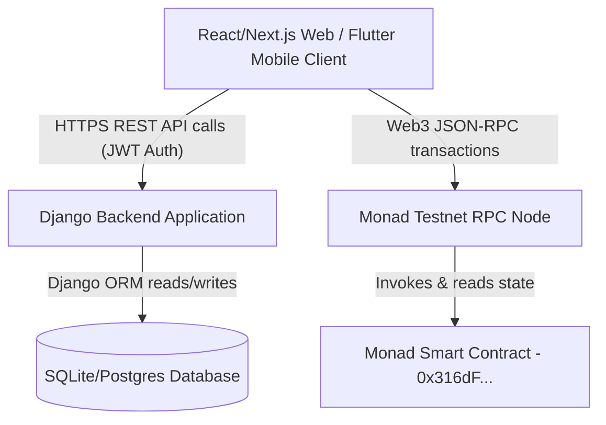

# 01. System Architecture

This document describes the high-level system architecture of the DebtProof platform, mapping components, communication flows, and blockchain interaction topologies.

## Overall Architecture Map

## Key Components

1. **Client Tier**:
   - **Web App**: Built with Next.js, React, TailwindCSS, Axios, and ethers.js/web3.js. Handles token authentication, state rendering, and wallet management client-side.
   - **Mobile App**: Built with Flutter, Riverpod, Dio, and web3dart. Mimics the exact flow of the Next.js client, consuming the same API endpoints.
   
2. **Backend Application Tier**:
   - Built on Django & Django REST Framework. Serves JWT token issuance, handles database operations, computes balances, generates proofs, and triggers audit trails.
   
3. **Database Tier**:
   - Standard relational schema (SQLite for development, PostgreSQL-ready). Manages Users, Loans, Payments, Receipts, and Audit Logs.
   
4. **Blockchain Tier**:
   - Monad Testnet execution layer (Chain ID: `10143`).
   - `DebtProofRegistry` Smart Contract acts as the trust anchor. Stores receipt cryptographic hashes associated with receipt IDs.

## Data & Communication Flow

- **Authentication Flow**: All API requests validate using JWT access tokens passed via `Authorization: Bearer <token>` headers.
- **Payment Anchoring Flow**:
  1. User registers payment metadata via REST API.
  2. Frontend calculates receipt document SHA-256 hash.
  3. Frontend requests a signed `proof_id` from the backend.
  4. Frontend sends a transaction to Monad Testnet executing `storeProof(proofId, receiptHash)` using the connected wallet.
  5. Frontend captures Monad tx hash and posts confirmation to backend `/proof/store/` endpoint.
