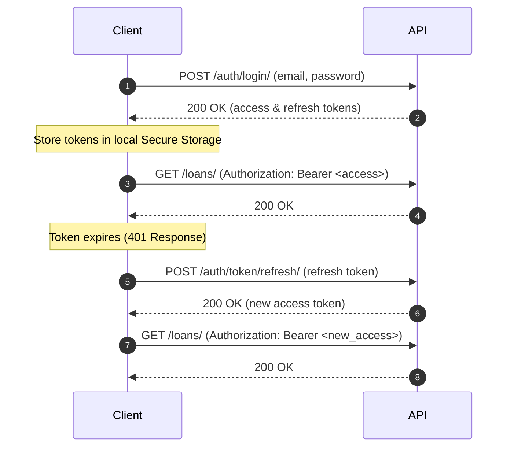

# 11. Authentication Flow

This document details the registration, login, token rotation, and sign-out logic for user sessions.

## JWT Authentication Protocol

DebtProof uses standard JSON Web Tokens (JWT) for secure authentication.

## 1. Login Flow
- **Endpoint**: `/api/v1/auth/login/` (POST)
- **Input**: `email`, `password`
- **Session Tokens**: Returns `access` (access token) and `refresh` (refresh token).
- **Client Storage**: Tokens must be saved in secure storage:
  - **Web**: LocalStorage or httpOnly Cookies.
  - **Mobile**: `flutter_secure_storage` library.

---

## 2. Token Refresh Interceptor Flow
To prevent session dropouts, the API client wraps request calls in an interceptor:
1. Before sending any request, inject header `Authorization: Bearer <access_token>`.
2. If any API call returns `401 Unauthorized`:
   - Intercept the call and pause other pending requests.
   - Post to `/api/v1/auth/token/refresh/` using the cached `refresh` token.
   - On success: Update the cached `access` token, retry the failed request, and resume pending requests.
   - On failure: Wipe secure storage, redirect the user to the login screen.
